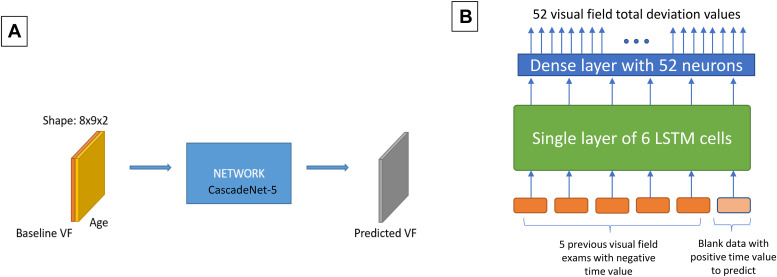
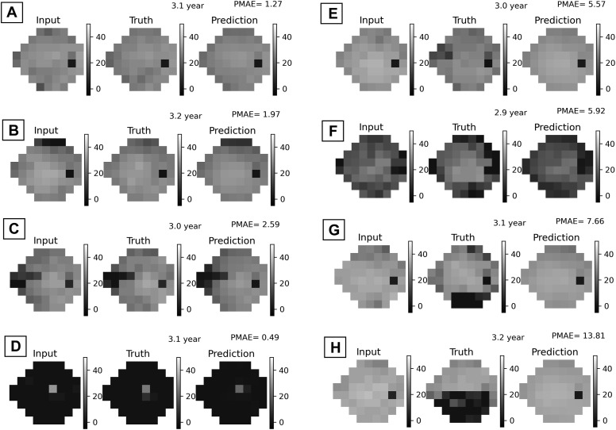
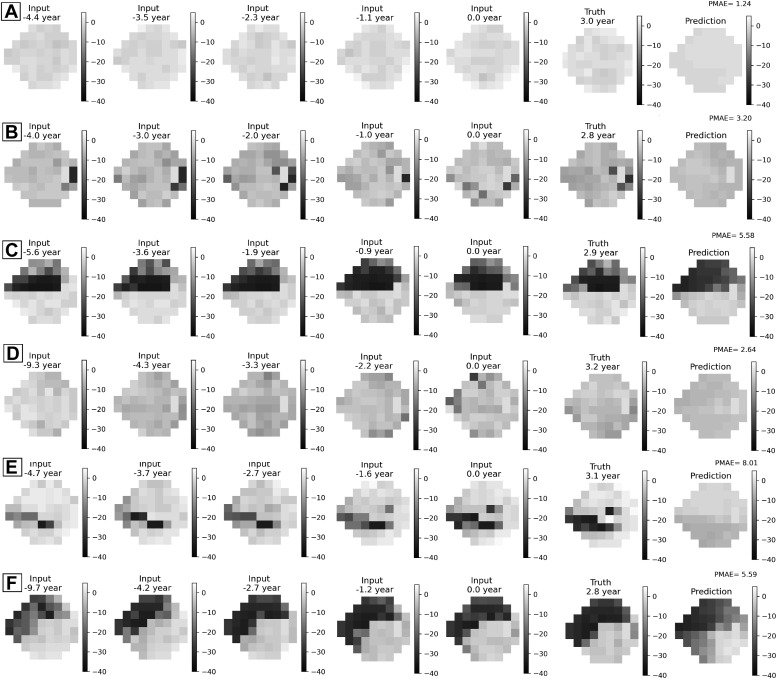

# VFPrediction
The repository of the following paper:
https://www.sciencedirect.com/science/article/pii/S2666914522001117

References:
Method_1: model introduced in: https://doi.org/10.1371/journal.pone.0214875  
Method_2: model introduced in: https://www.nature.com/articles/s41598-019-44852-6

Requirements (tested): 

tensorflow              2.4.0
h5py                    2.10.0
scikit-learn            1.0.1
pandas                  1.1.5

If you found this repository helpful, please cite it:
@article{eslami2023visual,
  title={Visual field prediction: evaluating the clinical relevance of deep learning models},
  author={Eslami, Mohammad and Kim, Julia A and Zhang, Miao and Boland, Michael V and Wang, Mengyu and Chang, Dolly S and Elze, Tobias},
  journal={Ophthalmology Science},
  volume={3},
  number={1},
  pages={100222},
  year={2023},
  publisher={Elsevier}
}